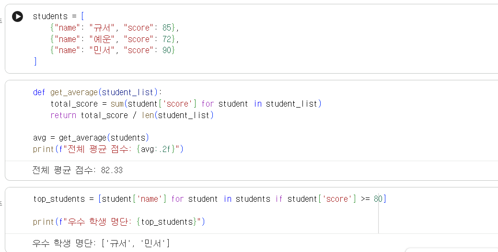

# Python 2주차 정규 과제 

📌Python 정규과제는 매주 정해진 분량의 『*파이썬 라이브러리를 활용한 데이터 분석*』 을 읽고 학습하는 것입니다. 이번주는 아래의 **Python_2nd_TIL**에 나열된 분량을 읽고 공부하시면 됩니다.

아래의 문제를 풀어보며 학습 내용을 점검하세요. 문제를 해결하는 과정에서 개념을 스스로 정리하고, 필요한 경우 참고 자료를 통해 보완하는 것이 좋습니다.

**교재 실습 예제 파일은 07_Python_Template 레포지토리의 notebooks 폴더에 업로드되어 있습니다.**

**👀(수행 인증샷은 필수입니다.)** 

## Python_2nd_TIL

### 3장 내장 자료구조, 함수, 파일
#### 1. 자료구조와 순차 자료형
#### 2. 함수
#### 3. 파일과 운영체제
#### 4. 마치며


## Study Schedule

| 주차  | 공부 범위     | 완료 여부 |
| ----- | ------------- | --------- |
| 1주차 | p.25~82    | ✅         |
| 2주차 | p.83~129   | ✅         |
| 3주차 | p.131~179  | 🍽️         |
| 4주차 | p.181~246 | 🍽️         |
| 5주차 | p.247~309 | 🍽️         |
| 6주차 | p.310~379 | 🍽️         |
| 7주차 | p.381~465 | 🍽️         |


<br>

<!-- 여기까진 그대로 둬 주세요-->

---

# 1️⃣ 학습 내용 정리

## 1. 자료구조와 순차 자료형

### 개념정리

### 자료구조와순차자료형
---
#### 튜플
- 한 번 할당되면 변경할 수 없는, 고정 길이를 갖는 파이썬의 순차 자료형
- 튜플 생성: `tup = (4, 5 6)`, `tup = 4, 5, 6`
- 각 원소는 대괄호 □를 이용해서 다른 순차 자료형처럼 접근 가능
- 튜플 내에 저장된 객체는 그 위치에서 바로 변경이 가능
- + 연산자를 이용해서 튜플을 이어 붙일 수 있음
- 튜플에 정수를 곱하면 리스트와 마찬가지로 여러 개의 튜플의 복사본이 반복되어 늘어남

#### 튜플에서 값 분리하기
- 파이썬에서 두 변수의 값을 바꿀 때
~~~python
In [26]: a, b =：L 2
In [29]: b, a = a, b
In [30]: a
Out[30]: 2
In [31]: b
Out[31]: 1
~~~
**-> 튜플이나 리스트를 순회할 때도 흔히 이 기능을 활용**

- 튜플의 시작 부분에서 값을 일부 끄집어내야 하는 상황이 종종 발생->  이때 특수한 문법인 `*rest`를 사용하며 함수의 시그니처에서 길이를 알 수 없는 긴 인수를 담기 위한 방법으로도 사용

#### 리스트
- 튜플과는 대조적으로 리스트는 크기나 내용을 변경 가능!
- 대괄호([])나 list 함수를 사용해서 생성
~~~python
a_list = [2, 3, 7, None]
tup = ("foo", "bar", "baz")
b_list = list(tup)
~~~
##### 원소 추가와 삭제
- append 메서드: 리스트의 끝에 새로운 값을 추가 가능
- insert 메서드: 리스트의 특정 위치에 값을 추가 가능
- pop 메서드: 특정 위치의 값을 반환하고 해당 값을 리스트에서 삭제
- remove 메서드: 리스트의 제일 앞에 위치한 값부터 원소 삭제
##### 리스트 이어 붙이기
- + 연산자를 이용하면 두 개의 리스트를 합치기 가능
- 리스트를 미리 정의했다면 extend 메서드를통해 여러 개의 값을 추가 가능 -> 큰 리스트일수록 이 메서드가 더 유리함
##### 정렬
- sort 함수를 이용해서 새로운 리스트를 생성하지 않고 있는 그대로 리스트를 정렬 가능(편의를 위해 몇가지 옵션 제공)
##### 슬라이싱
- 리스트와 같은 자료형 (배열, 튜플, ndarray)은 색인 연산자 [] 안에 start:stop을 지정해서 원하는 크기만큼 잘라낼 수 있음
- 이때 색인의 시작(start) 위치에 있는 값은 포함되지만끝(stop) 위치에 있는 값은 포함되지 않음!
- 음수 색인은 순차 자료형의 끝에서부터의 위치를 나타냄

### 딕셔너리
- 파이썬 객체인 키-값 쌍을 저장. 각 키는 값과 연관되어 특정 키가 주어지면 값을
편리하게 검색, 삽입, 수정 또는 삭제 가능
- 중괄호 {}를 사용해 콜론으로 구분된 키와 값을 둘러싸면 딕셔너리가 생성됨
#### 순차 자료형에서 딕셔너리 생성하기
~~~python
mapping = {}
for key, value in zip(key_list, value_list):
mapping[key] = value
~~~

### 집합
- 고유한 원소만 담는 정렬되지 않은 자료형
- set 함수를 이용하거 나 중괄호({})를 이용해서 생성

### 내장 순차 자료형 함수
- `enumerate`: 순차 자료형에서 현재 아이템의 색인을 함께 추적할 때
~~~python
for index, value in enumerate(collection):
* 여기서 value 변수를 사용할 수 있다.
~~~

- `sorted`: 정렬된 새로운 순차 자료형을 반환
- `zip`: 여러 개의 리스트나 튜플 또는 다른 순차 자료형을 서로 짝지어서 튜플 리스트를 생성
- `reversed`: 순차 자료형을 역순으로 순회


### 실습 인증

<!-- 예제 실습을 진행한 후, 실행 화면을 4-5장 캡쳐하여 제출해주세요. -->

<!-- 이 부분을 지우고 실행 화면을 제출해주세요. -->


## 2. 함수

### 개념정리

- 익명 함수: ambda 예약어로 익명 함수를 정의하며. 이는 '익명 함수를 선언한다'라는 의미
- 제네레티어: 이터레이터 프로토콜iterator protoc。을 이용해 순회 가능한 객체를 만들수 있음

### 실습 인증

<!-- 예제 실습을 진행한 후, 실행 화면을 4-5장 캡쳐하여 제출해주세요. -->

<!-- 이 부분을 지우고 실행 화면을 제출해주세요. -->


## 3. 파일과 운영체제

### 개념정리

- 파이썬의 내장 함수 **open**을 이용하면 파일 경로와 인코딩 방식을 지정해 파일에 쉽게 접근할 수 있음

- 파일 핸들은 반복문을 통해 매 줄을 순회하며 읽을 수 있으며, 읽어온 데이터의 줄 바꿈 문자는 별도의 처리가 필요

### 실습 인증

<!-- 예제 실습을 진행한 후, 실행 화면을 4-5장 캡쳐하여 제출해주세요. -->

<!-- 이 부분을 지우고 실행 화면을 제출해주세요. -->


# 2️⃣ 실습 과제

각 문제에 대한 실행 결과가 확인되도록 코드를 작성하고 실행한 뒤, **모든 문제의 실행 화면을 캡처하여 제출하시기 바랍니다.**

**1. 다음 형식으로 학생 정보를 저장하세요.**
```python
students = [
    {"name": "규서", "score": 85},
    {"name": "예운", "score": 72},
    {"name": "민서", "score": 90}
]
```

**2. 문제**
```
1. 전체 평균 점수를 구하는 함수 작성 및 결과 출력
  - students 리스트를 입력받아 평균 점수를 반환하는 get_average 함수를 작성하세요.
  - 함수를 호출하여 계산된 평균 점수를 print()를 이용해 화면에 출력하세요.

2. 80점 이상 우수 학생 추출 및 리스트 출력
  - 리스트 표기법을 사용하여 점수가 80점 이상인 학생의 이름만 담긴 새로운 리스트를 만드세요.
  - 생성된 우수 학생 명단 리스트를 print()를 이용해 화면에 출력하세요.
```




### 🎉 수고하셨습니다.


