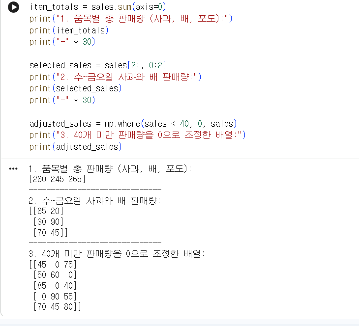

# Python 3주차 정규 과제 

📌Python 정규과제는 매주 정해진 분량의 『*파이썬 라이브러리를 활용한 데이터 분석*』 을 읽고 학습하는 것입니다. 이번주는 아래의 **Python_3rd_TIL**에 나열된 분량을 읽고 공부하시면 됩니다.

아래의 문제를 풀어보며 학습 내용을 점검하세요. 문제를 해결하는 과정에서 개념을 스스로 정리하고, 필요한 경우 참고 자료를 통해 보완하는 것이 좋습니다.

**교재 실습 예제 파일은 07_Python_Template 레포지토리의 notebooks 폴더에 업로드되어 있습니다.**

**👀(수행 인증샷은 필수입니다.)** 

## Python_3rd_TIL

### 4장 넘파이 기본: 배열과 벡터 연산
#### 1. 다차원 배열 객체 ndarray
#### 2. 난수 생성
#### 3. 유니버설 함수: 배열의 각 원소를 빠르게 처리하는 함수
#### 4. 배열을 이용한 배열 기반 프로그래밍
#### 5. 배열 데이터의 파일 입출력
#### 6. 선형대수
#### 7. 계단 오르내리기 예제
#### 8. 마치며 


## Study Schedule

| 주차  | 공부 범위     | 완료 여부 |
| ----- | ------------- | --------- |
| 1주차 | p.25~82    | ✅         |
| 2주차 | p.83~129   | ✅         |
| 3주차 | p.131~179  | ✅         |
| 4주차 | p.181~246 | 🍽️         |
| 5주차 | p.247~309 | 🍽️         |
| 6주차 | p.310~379 | 🍽️         |
| 7주차 | p.381~465 | 🍽️         |


<br>

<!-- 여기까진 그대로 둬 주세요-->

---

# 1️⃣ 학습 내용 정리

## 1. 다차원 배열 객체 ndarray

### 1-1.  ndarray 생성하기
#### `np.array()`: 리스트를 배열로 변환
- 파이썬의 리스트나 튜플 같은 순차 객체를 ndarray로 변환
- 1차원 배열: `data1 = [6, 7.5, 8]` → `arr1 = np.array(data1)`
- 다차원 배열: 중첩된 리스트(리스트 안 리스트)를 넣으면 자동으로 다차원 배열 생성
  - `data2 = [[1, 2, 3, 4], [5, 6, 7, 8]]` → `arr2 = np.array(data2)`
#### 배열의 속성 확인하기
- `array.ndim`: 차원의 수 
- `array.shape`: 각 차원의 크기를 나타내는 튜플 -> (n,m)은 n행 m열을 의미함
- `array.dtype`: 배열에 담긴 데이터의 자료형
  - 명시적으로 지정하지 않는 한 생성될 때 적절한 자료형을 스스로 추론
#### 배열 생성 함수 정리
- 원하는 형태를 튜플 형식으로 전달 (`np.empty((2, 3, 2))`,`np.zeros((3, 6))` 등)

| 함수 | 설명 |
|---|---|
|array|리스트, 튜플 등의 순차형 데이터를 ndarray로 변환. 자료형(dtype)을 자동 추론|
|asarray|입력 데이터를 ndarray로 변환. 입력 데이터가 이미 ndarray일 경우 복사 일어나지 않음|
|arange|내장 range 함수와 유사하지만 리스트 대신 ndarray를 반환|
|ones,ones.like|모든 요소를 1로 채움. _like는 주어진 배열과 똑같은 모양으로 생성|
|zeros, zeros_like |ones, ones_like와 동일하지만 내용을 0으로 채움|
|empty, empty_like|값의 초기화 없이 배열 생성. 속도는 빠르지만 가비지 값이 들어있음|
|full / full_like|사용자가 지정한 특정 값으로 배열을 가득 채움|
|eye,identity|N X N 크기의 단위 행렬 생성 (대각선은 1, 나머지는 0)|

### 1-2.  ndarray의 자료형
#### 자료형(dtype)
`dtype`: ndarray가 메모리에 있는 데이터를 어떻게 해석해야 하는지에 대한 정보를 담고 있는 객체
- 역할: 데이터가 저수준의 표현에 직접적으로 맞춰져 있어서 C언어나 포트란 같은 저수준 언어의 코드와 쉽게 연동 가능
- 형식: 자료형의 이름(int, float 등) + 하나의 원소가 차지하는 비트(bit) 수
#### 주요 자료형

|분류|자료형(dtype)|축약코드|설명|
|---|---|---|---|
|정수형|`int8`, `int16`, `int32`, `int64`|`i1`, `i2`, `i4`, `i8`|부호가 있는 정수|
|무부호 정수형|`uint8`, `uint16`, `uint32`, `uint64`|`u1`, `u2`, `u4`, `u8`|부호가 없는 정수|
|부동소수점|`float16`, `float32`, `float64`, `float128`|`f2`, `f4` 또는 `f`, `f8` 또는 `d`, `f16` 또는 `g`|`float64`는 배정밀도 부동소수점(파이썬 float과 호환) |
|복소수|`complex64`, `complexl28`, `complex256`|`c8`, `c16`, `c32`|각각 두 개의 32, 64,128비트 부동소수점을 가자는 복소수|
|불리언|`bool`|`?`|True와 False 값|
|객체|`object`|`O`|다양한 형태의 파이썬 객체|
|문자열|`string_`, `unicode_`|`S`, `U`|고정 길이 아스키 / 유니코드|

#### astype을 이용한 형 변환
`astype` 메서드를 사용하면 배열의 자료형을 명시적으로 변환 가능
- **숫자형 간의 변환**
    ```python
    # 부동소수점을 정수형으로 변환 -> 소수점 아래 자리는 버려짐
    arr = np.array([3.7, -1.2, 10.1])
    arr.astype(np.int32) 
    # 결과: array([3, -1, 10])
    ```
- **문자열의 숫자 변환**
    ```python
    numeric_strings = np.array(["1.25", "-9.6"], dtype=np.string_)
    numeric_strings.astype(float) # 알아서 알맞은 dtype 자료형인 np.float64로 인식
    ```
    - 주의: `numpy.string_`형은 데이터 크기가 고정되어 있어, 범위를 벗어나는 입력은 별도 경고 없이 잘릴 수 있음
- **다른 배열의 dtype 복사**
    ```python
    int_array = np.arange(10)
    calibers = np.array([.22, .270], dtype=np.float64)
    int_array.astype(calibers.dtype) # calibers의 float64 타입을 적용
    ```
### 1-3. 넘파이 배열의 산술 연산
#### 벡터화(Vectorization)
- **벡터화**: 반복문을 명시적으로 사용하지 않고, 배열의 모든 원소에 대해 동시에 일괄적으로 연산 적용
- 장점: 코드가 간결해지고 처리 속도가 압도적으로 빠름

#### 배열 간의 산술 연산
크기가 동일한 배열끼리 연산하면, 각 위치에 대응하는 숫자들끼리 계산됨
- e.g.,
    ```python
    arr = np.array([[1., 2., 3.], [4., 5., 6.]])
    # 결과: [[1*1, 2*2, 3*3], [4*4, 5*5, 6*6]]
    ```
#### 스칼라와의 연산
배열에 숫자 하나(스칼라)를 더하거나 곱하면, 그 숫자가 배열의 모든 원소에 똑같이 적용됨
- e.g., `arr * 2`: 모든 원소에 2를 곱함

#### 비교 연산
크기가 같은 배열끼리 > 나 < 같은 비교 연산을 하면, 그 결과로 True/False가 담긴 불리언(Boolean) 배열을 반환함
- e.g.,
    ```python
    arr2 = np.array([[0., 4., 1.], [7., 2., 12.]])
    arr2 > arr 
    # 결과: [[0>1, 4>2, 1>3], [7>4, 2>5, 12>6]]
    # 출력: [[False, True, False], [True, False, True]]
    ```

### 1-4. 색인과 슬라이싱기초
#### 색인(Indexing)과 슬라이싱(Slicing)
- **색인**: 데이터 구조에서 **특정 위치에 있는 단 하나의 요소**를 가리켜서 가져오는 것
  - 결과: 차원이 하나 줄어든 스칼라 값이나 하위 차원의 요소가 반환됩
- **슬라이싱**: 일정 범위에 속하는 **여러 요소의 집합(Subset)**을 잘라서 가져오는 것
  - 결과: 원본과 동일한 차원을 유지하는 새로운 배열이 반환됨

#### 뷰(View) vs 복사본(Copy)
넘파이의 핵심 기능 **뷰**: 슬라이싱은 데이터를 새로 복사하지 않고, 기존 ndarray의 데이터를 그대로 공유하며 바라봄
- 메모리 효율성: 데이터를 새로 만들지 않기 때문에 메모리 사용량이 늘어나지 않음
- 데이터 공유: 뷰에서 값을 수정하면 원본 배열의 값도 함께 바뀜(vice versa)
- 원본과 별개인 독립적인 배열을 얻고 싶다면 반드시 `.copy()`로 명시적으로 복사해야함

#### 1차원 배열 색인법
파이썬 리스트와 비슷하나 **브로드캐스팅**이라는 강력한 차이점이 존재
> **브로드캐스팅이란?** 특정 조건이 맞으면 작은 배열을 큰 배열의 모양에 맞춰 확장시킨 뒤 연산을 수행 -> 서로 다른 배열들 간 산술 연산을 가능하게
해줌

- `arr[5]`: 5번째 원소 선택, `arr[5:8]`: 5~8번째 원소 선택
- `arr[5:8]=12`: 브로드캐스팅되어 해당 영역의 모든 원소가 12로 변경
    ```python
    arr = np.arange(10)
    arr[5:8] = 12
    arr
    # array([ 0, 1, 2, 3, 4, 12, 12, 12, 8, 9]) -> 스칼라가 전체 영역으로 전파됨
    ```
#### 다차원 배열 색인법
- 인덱스 규칙: 파이썬과 마찬가지로 0부터 시작
- 2차원 배열
  - 형식: `arr[행_인덱스, 열_인덱스]`
- 3차원 배열
  - 형식: `arr[층_인덱스, 행_인덱스, 열_인덱스]`
- 색인을 하나 생략할 때마다 차원이 하나씩 줄어들면서 그 하위 데이터를 뭉텅이로 가져옴
  - `arr3d` : 전체 건물
  - `arr3d[0]` : 0층 전체 (평면)
  - `arr3d[0, 1]` : 0층의 1행 (선)
  - `arr3d[0, 1, 2]` : 0층의 1행 2열 (점/데이터 하나)

#### 슬라이스로 선택하기
- **슬라이싱** vs **인덱싱**: 슬라이스만 하면 차원이 유지됨. 인덱싱은 차원을 하나씩 축소시킴
  - `arr2d[:2, :1]`는 결과도 2차원 배열, `arr2d[1, :2]` 결과는 1차원 배열
- 전체 선택: `:`만 사용하면 해당 축의 모든 데이터를 가져옴

### 1-5. 불리언 값으로 선택하기
#### 불리언 배열
- 배열에 비교연산자(`==`, `!=`)를 사용하면 각 요소별로 비교가 수행되는 벡터화가 적용되어 불리언 배열 반환 `array([ True, False,])`
#### 불리언 색인
```python 
- data[names == "Bob"] # 특정 행 선택
- data[names == "Bob", 1] # "Bob"인 행의 1번 열만 선택 (차원 축소)
- data[names = "Bob", 1:] #"Bob"인 행의 1번 열부터 끝까지 선택
```
- 사용하려는 불리언 배열의 길이는 반드시 색인하려는 축의 길이와 일치해야함
- 불리언 색인을 통한 데이터 선택은 원본의 view가 아닌 copy가 생성됨
#### 부정 연산자
- `names != "Bob"` : "Bob"이 아닌 요소들
- `~(names == "Bob")` : 위와 동일한 결과 (~는 불리언 배열을 뒤집는 연산자)
#### 논리 연산자의 다중 조건
여러 조건을 결합할 때는 and나 or 대신 넘파이 전용 연산자 사용해야함
- `&`: and
- `|`: or
#### 데이터 수정 및 대입

## 2. 난수 생성

### 개념정리

유사난수:난수 생성기의 시드seed 값에 따라 정해진 난수를 알고리듬으로 생성

### 실습 인증

<!-- 예제 실습을 진행한 후, 실행 화면을 2-3장 캡쳐하여 제출해주세요. -->

<!-- 이 부분을 지우고 실행 화면을 제출해주세요. -->


## 3. 유니버설 함수: 배열의 각 원소를 빠르게 처리하는 함수

### 개념정리
유니버설 함수는: ndarray 안의 데이터 원소별로 연산을 수행하는
함수. 유니버설 함수는 하나 이상의 스칼라 값을 받아서 하나 이상의 스칼라 결괏값을 반환함.
하는 간단한 함수를 빠르게 수행하는 벡터화된 래퍼 함수
<!-- 이 부분을 지우고 새롭게 배우게 된 내용을 정리해주세요. -->

### 실습 인증

<!-- 예제 실습을 진행한 후, 실행 화면을 2-3장 캡쳐하여 제출해주세요. -->

<!-- 이 부분을 지우고 실행 화면을 제출해주세요. -->


## 4. 배열을 이용한 배열 기반 프로그래밍

### 개념정리
- 불리언 배열에서 sum 메서드를 실행하면 True인 원소의 개수가 반환.
- 넘파이 배열 역시 sort 메서드를 이용해 정렬
- 넘파이는 1 차원 ndarray를 위한 몇 가지 기본적인 집합 연산을 제공
<!-- 이 부분을 지우고 새롭게 배우게 된 내용을 정리해주세요. -->

### 실습 인증

<!-- 예제 실습을 진행한 후, 실행 화면을 2-3장 캡쳐하여 제출해주세요. -->

<!-- 이 부분을 지우고 실행 화면을 제출해주세요. -->


## 5. 배열 데이터의 파일 입출력

### 개념정리
numpy.savez 함수를 이용하면 여러 개의 배열을 압축된 형식으로 저장 가능. 저장하려는 배열은 키워드 인수 형태로 전달
<!-- 이 부분을 지우고 새롭게 배우게 된 내용을 정리해주세요. -->

### 실습 인증

<!-- 예제 실습을 진행한 후, 실행 화면을 2-3장 캡쳐하여 제출해주세요. -->

<!-- 이 부분을 지우고 실행 화면을 제출해주세요. -->


## 6. 선형대수

### 개념정리
두 개의 2차원 배열을 * 연산자로 곱하면 행렬 곱셈이 아니라 대응하는
각각의 원소의 곱을 계산. 따라서 배열 메서드이자 넘파이 네임스페이스 안에 있는 함수인 dot 함수를 이용해 행렬 곱셈을 계산해야함
<!-- 이 부분을 지우고 새롭게 배우게 된 내용을 정리해주세요. -->

### 실습 인증

<!-- 예제 실습을 진행한 후, 실행 화면을 2-3장 캡쳐하여 제출해주세요. -->

<!-- 이 부분을 지우고 실행 화면을 제출해주세요. -->


## 7. 계단 오르내리기 예제

```python
In [256]: nsteps = 1000
In [257]: rng = np.random.default_rng(seed=12345) # 새로운 난수 생성기
In [258]: draws = rng.integers(0, 2, size=nsteps)
In [259]: steps = np.where(draws = 0, 1, -1)
```
### 개념정리

<!-- 이 부분을 지우고 새롭게 배우게 된 내용을 정리해주세요. -->

### 실습 인증

<!-- 예제 실습을 진행한 후, 실행 화면을 2-3장 캡쳐하여 제출해주세요. -->

<!-- 이 부분을 지우고 실행 화면을 제출해주세요. -->


# 2️⃣ 실습 과제

각 문제에 대한 실행 결과가 확인되도록 코드를 작성하고 실행한 뒤, **모든 문제의 실행 화면을 캡처하여 제출하시기 바랍니다.**

**1. 아래 코드를 실행하여 5일간 3개 품목의 판매량 데이터를 생성합니다.**
```python
import numpy as np

# 5일간 3개 품목의 판매량
# 행: 월, 화, 수, 목, 금 / 열: 사과, 배, 포도
sales = np.array([
    [45, 30, 75],  # 월요일
    [50, 60, 15],  # 화요일
    [85, 20, 40],  # 수요일
    [30, 90, 55],  # 목요일
    [70, 45, 80]   # 금요일
])
```

**2. 문제**
```
1. 품목별 총 판매량 계산 및 출력
  - 문제 설명: 각 품목이 5일 동안 총 몇 개 팔렸는지 계산
  - sum() 메서드의 axis 옵션을 활용하여 품목별 합계를 구하세요.
  - print()를 이용해 품목별 총 판매량 리스트를 출력하세요.

2. 특정 기간 및 품목 추출
  - 문제 설명: 수요일부터 금요일까지(3~5행), 첫 번째와 두 번째 품목(사과, 배)의 판매량만 따로 보기 
  - 배열 슬라이싱을 사용하여 해당 데이터를 추출하세요.
  - print()를 이용해 추출된 3x2 배열을 출력하세요.

3. 목표 미달 판매량 조정
  - 문제 설명: 하루 판매량이 40개 미만인 경우, 값을 0으로 표시하고, 40개 이상인 경우는 기존 값을 유지
  - np.where() 함수를 사용하여 40 미만은 0, 40 이상은 원래 값을 가지는 새로운 배열을 만드세요.
  - print()를 이용해 수정된 배열을 출력하세요.
```

<!-- 이 부분을 지우고 인증 사진을 제출해주세요.-->



### 🎉 수고하셨습니다.


