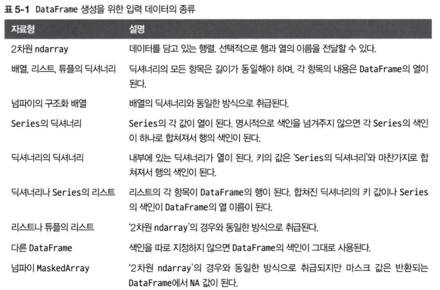
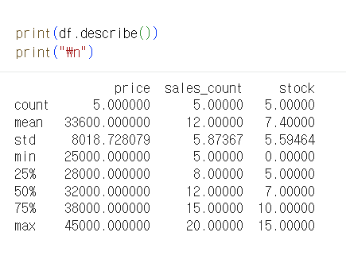
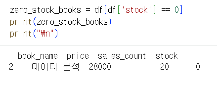
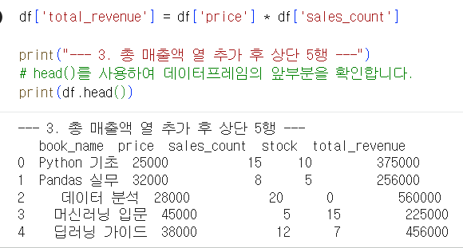

# Python 4주차 정규 과제 

📌Python 정규과제는 매주 정해진 분량의 『*파이썬 라이브러리를 활용한 데이터 분석*』 을 읽고 학습하는 것입니다. 이번주는 아래의 **Python_4th_TIL**에 나열된 분량을 읽고 공부하시면 됩니다.

아래의 문제를 풀어보며 학습 내용을 점검하세요. 문제를 해결하는 과정에서 개념을 스스로 정리하고, 필요한 경우 참고 자료를 통해 보완하는 것이 좋습니다.

**교재 실습 예제 파일은 07_Python_Template 레포지토리의 notebooks 폴더에 업로드되어 있습니다.**

**👀(수행 인증샷은 필수입니다.)** 

## Python_4th_TIL

### 5장 판다스 시작하기 
#### 1. 판다스 자료구조 소개
#### 2. 핵심 기능
#### 3. 기술 통계 계산과 요약
#### 4. 마치며 


## Study Schedule

| 주차  | 공부 범위     | 완료 여부 |
| ----- | ------------- | --------- |
| 1주차 | p.25~82    | ✅         |
| 2주차 | p.83~129   | ✅         |
| 3주차 | p.131~179  | ✅         |
| 4주차 | p.181~246 | ✅         |
| 5주차 | p.247~309 | 🍽️         |
| 6주차 | p.310~379 | 🍽️         |
| 7주차 | p.381~465 | 🍽️         |


<br>

<!-- 여기까진 그대로 둬 주세요-->

---

# 1️⃣ 학습 내용 정리

## 1. 판다스 자료구조 소개
### 1-1. Series
#### Series의 기본 구조 및 생성
Series: 값들의 배열과 색인 객체를 동시에 가진 자료구조
- 생성: `pd.Series([data])` 
  - 별도 지정이 없으면 색인은 0부터 N-1까지 정수로 부여됨
  - 색인 지정 생성: `pd.Series(data, index=["a", "b", ...])`
  - 생성된 후에도 `obj.index = [...]` 대입을 통해 기존 색인을 완전히 새로운 값으로 교체 가능
- 주요 속성
  - `.array`: 데이터를 담고 있는 PandasArray 반환
  - `.index`: Series의 색인 객체 반환
#### 데이터 선택 및 연산
기본적으로 넘파이 배열의 연산 방식(벡터화)을 그대로 지원하나, 차이점이 있다면 값을 선택할 때 색인으로 라벨(label)도 사용 가능
 - 색인이 a,b,c로 되어있으면 `obj["a"]` 또는 `obj[["a", "c"]]` 처럼 색인 이름을 사용하여 값 선택 가능
 - 벡터화 연산: 불리언 배열을 통한 필터링(`obj[obj > 0]`), 스칼라 곱셈(`obj * 2`), 수학 함수(`np.exp(obj)`) 적용 시에도 색인-값의 고유 연결고리는 유지됨
#### Series와 딕셔너리
Series는 고정 길이의 정렬된 딕셔너리라고 이해 가능
- `in` 연산자로 특성 **색인**이 존재하는지 확인 가능(`"b" in obj`: 불리언값 반환)
- Series <-> Dictionary
  - `pd.Series(dict_data)`: 딕셔너리 객체에서 Series 생성 가능
  - `obj.to_dict()`: Series를 딕셔너리로 변환
  - 딕셔너리로 생성할 때 index 인자를 별도로 넘기면 해당 순서에 맞춰 데이터가 배치됨
#### 결측치 확인
- `pd.isna(obj)` 또는 `obj.isna()`: 누락된 데이터면 `True`
- `pd.notna(obj)`: 데이터가 존재하면 `True`
#### 산술 연산과 데이터 정렬
- Series에서는 산술 연산시 데이터 순서가 맞지 않아도 **색인 라벨을 기준으로 자동 정렬**됨 (데이터베이스의 outer join과 유사한 원리로 작동)
- 데이터의 순서가 달라도, 심지어 포함된 항목이 달라도 라벨 이름만 보고 알아서 짝을 찾아주는 기능!
#### name 속성
- Series 객체와 색인 객체는 각자의 name을 가질 수 있음
- 이름 설정
  - `obj.name` = "이름" (Series 자체의 이름)
  - `obj.index.name` = "이름" (색인 축의 이름)

### 1-2. DataFrame
DataFrame은 행(row)과 열(column)로 이루어진 2차원 테이블 형태의 자료구조로, 각 열마다 서로 다른 데이터 타입(숫자, 문자열 등)을 가질 수 있음
#### DataFrame 생성 및 조회
생성방법
- 딕셔너리 이용: 같은 길이의 리스트를 가진 딕셔너리를 pd.DataFrame()에 전달
    ```python
    data = {"state": ["Ohio", "Ohio", "Ohio", "Nevada", "Nevada", "Nevada"],
    "year": [2000, 2001, 2002, 2001, 2002, 2003],
    "pop": [1.5, 1.7, 3.6, 2.4, 2.9, 3.2]}
    frame = pd.DataFrame(data)
    ```
- 중첩 딕셔너리: `{열이름: {행이름: 값}}` 구조로 전달 
    ```python
    populations = {"Ohio": {2000: 1.5, 2001: 1.7, 2002: 3.6}, "Nevada": {2001: 2.4, 2002: 2.9}}
    frame = pd.DataFrame(populations)
    ```
  - `index`를 통해 색인을 직접 지정하면 안쪽 딕셔너리의 키값과 상관없이 지정된 인덱스로 색인이됨


- 칼럼 순서 지정: `columns` 인자를 통해 원하는 순서로 열을 배치하거나, 없는 열을 추가(NaN 발생)할 수 있음
    ```python
    pd.DataFrame(data, columns=["year", "state", "pop"])
    ```
데이터 확인
- `df.head()` / `df.tail()`: 상위/하위 5개 행을 확인
- `df.to_numpy()`: 데이터를 2차원 넘파이 배열(ndarray)로 변환(이때 DataFrame의 열들이 서로 다른 자료형 가지면 변환된 자료형 자동 선택됨)
#### 열과 행 다루기
열 다루기
- 선택: `df["열이름"]` (딕셔너리 방식) 또는 `df.열이름` (점 표기법)으로 Series를 반환
- 수정: `df["debt"] = 16.5`와 같이 스칼라 값을 대입하거나, 배열/Series를 대입할 수 있음
  - 리스트나 배열을 대입할 때는 대입하려는 길이가 DataFrame의 길이와 동일해야함
  - Series를 대입할 때는 DataFrame의 색인에 따라 값이 대입되며 존재하지 않는 색인에는 NaN 반환
- 추가 및 삭제
  - 존재하지 않는 열을 대입하면 새로운 열이 생성됨(이때 점 표기법으로는 새로운 열 생성 안됨)
  - `del df["열이름"]`: 특정 열 삭제 
> *열 선택으로 얻은 Series는 원본의 **뷰(View)**이므로, 수정 시 원본 DataFrame도 변경

행 다루기
- 선택: `loc`을 통해 레이블 기준으로 행을 선택할 수 있고, `iloc`을 통해 정수 위치(인덱스 번호)를 기준으로 행을 선택할 수 있음

#### DataFrame의 name
Series와 달리 DataFrame에는 name 속성이 없음 -> 가로축과 세로축(행과 열)은 각각 name 속성을 가질 수 있음
- `frame.index.name`: 색인(세로축)의 이름을 알려줌 
- `frame.columns.name`: 열(가로축)의 이름을 알려줌

#### 색인 개체
- 불변성: 한번 생성된 index 객체는 각 요소를 변경할 수 없음(부분 수정 불가능) -> 여러 자료구조 간 안전한 공유 가능
- 중복 허용: 파이썬의 set와 달리 판다스의 Index는 중복된 레이블을 가질 수 있으며, 선택 시 해당 레이블을 가진 모든 데이터가 반환됨

- 주요 색인 메서드 및 속성

    |메서드/속성|설명|
    |---|---|
    |append()|추가적인 색인 객체를 붙여 새로운 색인 반환|
    |isin()|각 값이 넘겨받은 배열에 존재하는지 불리언 배열 반환|
    |drop()|특정 값이 삭제된 새로운 색인 반환|
    |is_unique|중복되는 색인이 없는지 확인|
    |unique()|중복을 제거한 유일한 값들만 반환|


<!-- 예제 실습을 진행한 후, 실행 화면을 2-3장 캡쳐하여 제출해주세요. -->

<!-- 이 부분을 지우고 실행 화면을 제출해주세요. -->


## 2. 핵심 기능
### 2-1. 재색인(Reindex)
#### Series에서의 재색인
- `reindex`: 데이터를 새로운 색인에 맞게 재배열, 존재하지 않는 색인값에 대해서는 NaN 추가
    ```python
    obj = pd.Series([4.5, 7.2, -5.3, 3.6], index=["d", "b", "a", "c"])
    obj2 = obj.reindex(["a", "b", "c", "d", "e"])
    # 데이터가 reindex 기준으로 재배치되고, e 인덱스는 NaN 반환
    ```
- 데이터 보간: 시계열 데이터 등의 순차적 데이터에서 빈 곳 채워야 할 때 method 옵션 사용 가능
    ```python
    obj = pd.Series(["blue", "purple", "yellow"], index=[0, 2, 4])

    obj.reindex(np.arange(6), method="ffill") 
    # 누락된 값을 직전의 값으로 채움 (Forward fill)

    obj.reindex(np.arange(6), method="bfill") 
    # 누락된 값을 다음의 값으로 채움 (Backward fill)
    ```
#### DataFrame에서의 재색인
DataFrame은 행(색인)과 열 모두 재색인 가능
- 행 재색인: `df.reindex(index=[...])` 또는 그냥 순서만 전달하면 기본값으로 행이 재색인됨
- 열 재색인: `df.reindex(columns=[...])`
- 축 지정 방식: `axis="columns"` 또는 `axis="index"` 키워드를 사용하여 재색인할 대상 명시 가능
#### reindex 함수의 주요 인수

|인수|설명|
|---|---|
|`labels`|색인으로 사용할 새로운 이름|
|`method`|비어 있는 값을 채우는 방법 (ffill, bfill)|
|`fill_value`|NaN 대신 사용할 특정 값|
|`tolerance`|전/후 보간 시에 사용할 최대 갭 크기（값의 차이）|
|`copy`|기본값 True는 새로운 색인이 이전과 같아도 데이터를 복사함(메모리 두배로 사용하나 안정적)|

#### `loc`를 이용한 간편 재색인 
- 차이점: `loc`은 지정한 레이블이 이미 DataFrame에 존재할 때 주로 사용하며, 존재하지 않는 레이블을 넣으면 오류 발생 가능. 반면 `reindex`는 없는 레이블도 NaN으로 자동 생성.
### 하나의 행이나 열 삭제하기
불필요한 행이나 열을 제거할 때 `drop` 메서드 사용 -> 원본을 직접 수정하지 않고, 선택한 항목이 삭제된 새로운 객체를 반환
#### Series에서의 삭제
삭제하고자 하는 색인 전달
- 단일 삭제: `obj.drop("c")` → "c" 색인이 제거된 새로운 Series 반환
- 다중 삭제: `obj.drop(["d", "c"])` → 리스트 형태로 여러 개를 한꺼번에 삭제 가능
#### DataFrame에서의 삭제
DataFrame은 행과 열이라는 두 개의 축이 있으므로, 삭제할 방향을 명시해야함
- 행(Row) 삭제
    ```python
    data.drop(index=["Ohio", "Colorado"]) # index 키워드 사용
    data.drop("Ohio", axis=0) # axis 인수 사용
    ```
- 열(Column) 삭제
```python
data.drop(columns=["two", "four"]) # columns 키워드 사용
data.drop("two", axis=1) # axis 인수 사용
```

### 실습 인증

<!-- 예제 실습을 진행한 후, 실행 화면을 2-3장 캡쳐하여 제출해주세요. -->

<!-- 이 부분을 지우고 실행 화면을 제출해주세요. -->


## 3. 기술 통계 계산과 요약

### 개념정리

<!-- 이 부분을 지우고 새롭게 배우게 된 내용을 정리해주세요. -->

### 실습 인증

<!-- 예제 실습을 진행한 후, 실행 화면을 2-3장 캡쳐하여 제출해주세요. -->

<!-- 이 부분을 지우고 실행 화면을 제출해주세요. -->


# 2️⃣ 실습 과제

각 문제에 대한 실행 결과가 확인되도록 코드를 작성하고 실행한 뒤, **모든 문제의 실행 화면을 캡처하여 제출하시기 바랍니다.**

**1. 아래 코드를 실행하여 도서 매출 데이터를 생성합니다.**
```python
import pandas as pd
import numpy as np

# 도서 데이터 생성
data = {
    "book_name": ["Python 기초", "Pandas 실무", "데이터 분석", "머신러닝 입문", "딥러닝 가이드"],
    "price": [25000, 32000, 28000, 45000, 38000],
    "sales_count": [15, 8, 20, 5, 12],
    "stock": [10, 5, 0, 15, 7]
}
df = pd.DataFrame(data)
```

**2. 문제**
```
1. 데이터 확인 및 기초 통계 출력
  - 문제 설명: 요약 정보 확인 
  - describe() 메서드를 사용하여 수치형 데이터(가격, 판매량 등)의 기술 통계 정보를 출력하세요.
  - print()를 이용해 기술 통계 결과를 화면에 출력하세요.

2. 특정 조건의 데이터 필터링 (불리언 색인)
  - 문제 설명: 현재 재고가 하나도 없는(0인) 도서 찾기 
  - stock 열의 값이 0인 행만 추출하여 새로운 변수에 저장하세요.
  - print()를 이용해 재고가 0인 도서의 정보를 출력하세요.

3. 새로운 열 추가 (파생 변수 생성)
  - 문제 설명: 각 도서별 총 매출액(total_revenue) 계산
  - price와 sales_count를 곱하여 total_revenue라는 새로운 열을 추가하세요.
  - print()를 이용해 새로운 열이 추가된 DataFrame의 상단 5행(head)을 출력하세요.
```






### 🎉 수고하셨습니다.


