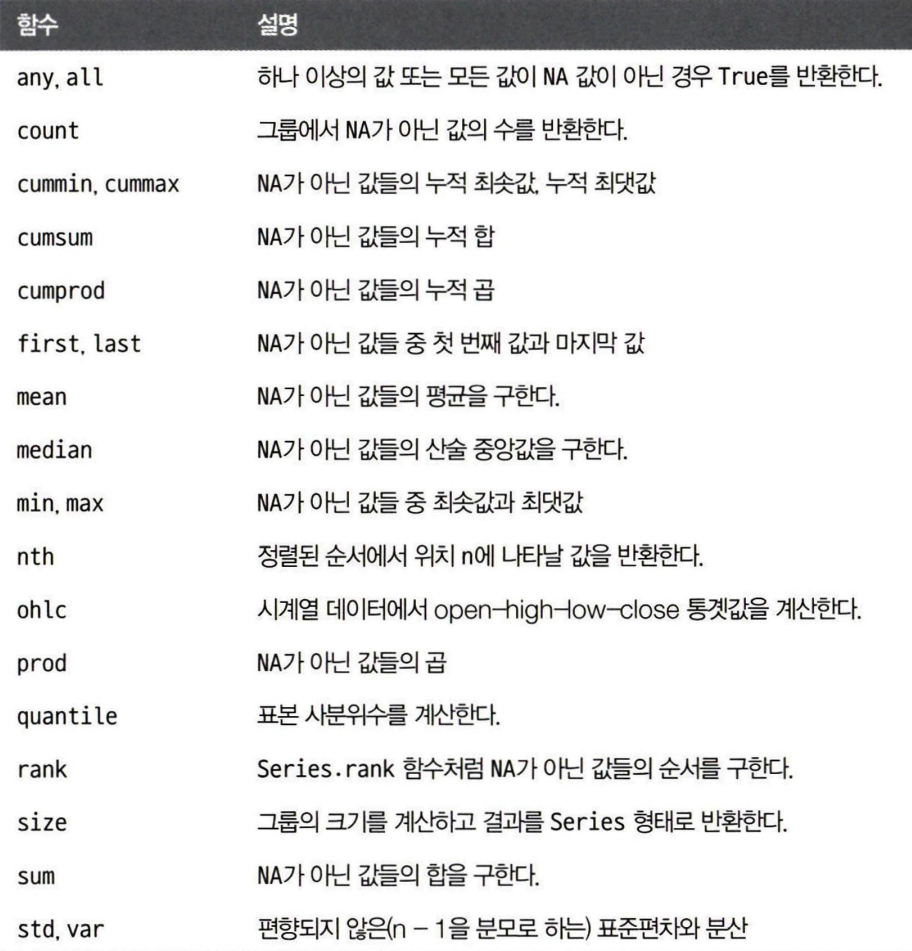

# Python 7주차 정규 과제 

📌Python 정규과제는 매주 정해진 분량의 『*파이썬 라이브러리를 활용한 데이터 분석*』 을 읽고 학습하는 것입니다. 이번주는 아래의 **Python_7th_TIL**에 나열된 분량을 읽고 공부하시면 됩니다.

아래의 문제를 풀어보며 학습 내용을 점검하세요. 문제를 해결하는 과정에서 개념을 스스로 정리하고, 필요한 경우 참고 자료를 통해 보완하는 것이 좋습니다.

**교재 실습 예제 파일은 07_Python_Template 레포지토리의 notebooks 폴더에 업로드되어 있습니다.**

**👀(수행 인증샷은 필수입니다.)** 

## Python_7th_TIL

### 9장 그래프와 시각화 
#### 1. 맷플롯립 API 간략하게 살펴보기
#### 2. 판다스에서 시본으로 그래프 그리기 
#### 3. 다른 파이썬 시각화 도구
#### 4. 마치며
### 10장 데이터 집계와 그룹 연산
#### 1. 그룹 연산에 대한 고찰
#### 2. 데이터 집계
#### 3. apply 메서드: 일반적인 분리-적용-병합
#### 4. 그룹 변환과 래핑되지 않은 groupby
#### 5. 피벗 테이블과 교차표
#### 6. 마치며 

## Study Schedule

| 주차  | 공부 범위     | 완료 여부 |
| ----- | ------------- | --------- |
| 1주차 | p.25~82    | ✅         |
| 2주차 | p.83~129   | ✅         |
| 3주차 | p.131~179  | ✅         |
| 4주차 | p.181~246 | ✅         |
| 5주차 | p.247~309 | ✅         |
| 6주차 | p.310~379 | ✅         |
| 7주차 | p.381~465 | ✅         |

 

<!-- 여기까진 그대로 둬 주세요-->

---

# 1️⃣ 학습 내용 정리

## 1. 맷플롯립 API 간략하게 살펴보기

### 개념정리
- matplotlib import 컨벤션: `import matplotlib.pyplot as plt`
- 맷플롯립에서 그래프는 피겨figure 객체 내에 존재: f`ig = plt.figure()`
- add_subplot을 사용해 최소 하나 이상의 subplots를 생성
- plt.subplots 메서드: 새로운 피겨 객체를 생성하고 생성된 서브플롯 객체를 담은 넘파이 배열을 반환
- X축의 눈금을 변경하는 가장 쉬운 방법은 set.xticks와 set_xticklabels 메서드를 사용하
는 것

### 실습 인증

<!-- 예제 실습을 진행한 후, 실행 화면을 2-3장 캡쳐하여 제출해주세요. -->

<!-- 이 부분을 지우고 실행 화면을 제출해주세요. -->

## 2. 판다스에서 시본으로 그래프 그리기 

### 개념정리

|인수|설명|
|---|---|
|label | 그래프의 범례 이름 |
ax |그래프를 그릴 맷플롯립의 서브플롯 객체, 만약 아무것도 넘어오지 않으면 현재 활성화되어 있는 맷플롯립의 서브플롯을 사용한다.
style |맷플롯립에 전달할 ko- 같은 스타일 문자열
alpha |그래프투명도(0부터 1 까지)
kind |그래프 종류로 area, bar, barh, density, hist, kde, line, pie가 있다.
figsize |생성할 그래프 크기를 튜플로 지정
logx |True를 넘기면 X축에 대해 로그 스케일을 적용한다. 음수를 값으로 허용하는 대칭 로그의 경우 sym을 넘긴다
logy |True를 넘기면 y축에 대해 로그 스케일을 적용한다. 음수를 값으로 허용하는 대칭 로그의 경우 sym을 넘긴다.
title |그래프 제목으로 사용할 문자열
use_index| 객체의 색인을 눈금 이름으로 사용할지 여부
rot| 눈금 이름을 회전시킴(0부터 360까지)
xticks |X축으로 사용할 값
yticks |y축으로 사용할 값
xlim |X축 한계(예: [0, 10])
ylim| y축한계
grid |축의 그리드를 표시할지 여부(가본값은 켜기)

### 실습 인증

<!-- 예제 실습을 진행한 후, 실행 화면을 2-3장 캡쳐하여 제출해주세요. -->

<!-- 이 부분을 지우고 실행 화면을 제출해주세요. -->

## 3. 다른 파이썬 시각화 도구

### 개념정리

2010년부터 웹을 위한 대화형 그래픽 도구 개발이 본격적으로 진행되면서 알
테어, 보케,플로틀리 같은 도구를 이용해 웹 브라우저상에서 파이썬으로 동적 대화형
그래프를 그릴 수 있게됨

### 실습 인증

<!-- 예제 실습을 진행한 후, 실행 화면을 2-3장 캡쳐하여 제출해주세요. -->

<!-- 이 부분을 지우고 실행 화면을 제출해주세요. -->

## 4. 그룹 연산에 대한 고찰

### 개념정리

- 분리-적용-결합
    - 그룹 연산의 첫 번째 단계에서는 Series, DataFrame 같은 판다스 객체나 다른 객체에 들어 있는 데이터를 하나 이상의 키 기준으로 분리
    - 분리하고 나면 함수를
각 그룹에 적용시켜 새로운 값을 얻어냄
    - 마지막으로 함수를 적용한 결과를 하나의 객체로 결합

### 실습 인증

<!-- 예제 실습을 진행한 후, 실행 화면을 2-3장 캡쳐하여 제출해주세요. -->

<!-- 이 부분을 지우고 실행 화면을 제출해주세요. -->

## 5. 데이터 집계

### 개념정리

<!-- 이 부분을 지우고 새롭게 배우게 된 내용을 정리해주세요. -->

### 실습 인증

<!-- 예제 실습을 진행한 후, 실행 화면을 2-3장 캡쳐하여 제출해주세요. -->

<!-- 이 부분을 지우고 실행 화면을 제출해주세요. -->

## 6. apply 메서드: 일반적인 분리-적용-병합 

### 개념정리

<!-- 이 부분을 지우고 새롭게 배우게 된 내용을 정리해주세요. -->

### 실습 인증

<!-- 예제 실습을 진행한 후, 실행 화면을 2-3장 캡쳐하여 제출해주세요. -->

<!-- 이 부분을 지우고 실행 화면을 제출해주세요. -->

## 7. 그룹 변환과 래핑되지 않은 groupby

### 개념정리

<!-- 이 부분을 지우고 새롭게 배우게 된 내용을 정리해주세요. -->

### 실습 인증

<!-- 예제 실습을 진행한 후, 실행 화면을 2-3장 캡쳐하여 제출해주세요. -->

<!-- 이 부분을 지우고 실행 화면을 제출해주세요. -->

## 8. 피벗 테이블과 교차표 

### 개념정리

<!-- 이 부분을 지우고 새롭게 배우게 된 내용을 정리해주세요. -->

### 실습 인증

<!-- 예제 실습을 진행한 후, 실행 화면을 2-3장 캡쳐하여 제출해주세요. -->

<!-- 이 부분을 지우고 실행 화면을 제출해주세요. -->

---

이번 주차는 마지막 주차로, 별도의 실습 과제가 없습니다.

부족한 커리큘럼이었음에도 불구하고 한 학기 동안 과제를 성실하게 수행해주셔서 감사합니다.

파이썬 과제 제작을 마무리하는 시점에 이 글을 작성하고 있는데, 저 또한 파이썬에 능통하거나 익숙하지 않았지만, 과제를 제작하기 위해 책을 찾아보고, 템플릿을 제작하고 검수하면서 많은 배움이 있었던 것 같습니다. 

여러분들께서도 모든 과제를 마친 지금 시점에 파이썬이 아직 낯설게 느껴질 수도 있을 것 같습니다.

하지만 자주 접하고, 직접 코드를 작성해보고, 데이터를 어떻게 다루면 좋을지 고민해보는 시간을 가지다 보면 점점 익숙해질 것이라 생각합니다.

정말 고생 많으셨고, 여러분들께서 앞으로 파이썬을 활용하는 데에 있어 이 과제가 한 줌이라도 보탬이 된다면 정말 감사하겠습니다.

여러분의 앞날을 응원합니다!! 😄

### 🎉 수고하셨습니다.

